# Arquitectura de TalkToMe

TalkToMe le da voz a Claude Code. No modifica Claude Code ni se interpone entre usted y el modelo: se conecta por **hooks**, lee lo que Claude ya escribió en pantalla, decide qué vale la pena decir en voz alta y lo dice con ElevenLabs, en segundo plano.

Este documento explica cómo está armado por dentro. Para instalarlo y usarlo, vea el [README](../README.md). La referencia de cada módulo, archivo de estado y clave de configuración está en [REFERENCIA.md](REFERENCIA.md).

## Índice

1. [Principios de diseño](#1-principios-de-diseño)
2. [Vista general](#2-vista-general)
3. [Módulos y dependencias](#3-módulos-y-dependencias)
4. [Del hook al altavoz: una respuesta](#4-del-hook-al-altavoz-una-respuesta)
5. [Qué decir: las tres capas](#5-qué-decir-las-tres-capas)
6. [Interrupción, "repite" y "detalle"](#6-interrupción-repite-y-detalle)
7. [Varias terminales: sesiones y turnos](#7-varias-terminales-sesiones-y-turnos)
8. [Frases de Rachel: mazos barajados](#8-frases-de-rachel-mazos-barajados)
9. [Audio: streaming, caché y reproductores](#9-audio-streaming-caché-y-reproductores)
10. [Estado en disco](#10-estado-en-disco)
11. [Instalación en Claude Code](#11-instalación-en-claude-code)
12. [Errores y diagnóstico](#12-errores-y-diagnóstico)
13. [Cómo extenderlo](#13-cómo-extenderlo)

---

## 1. Principios de diseño

| Principio | Cómo se cumple |
|---|---|
| **Nunca frenar a Claude Code** | Cada hook responde en milisegundos: todo lo que toca la red o el audio corre en un *worker* separado (`player.spawn`). |
| **Nunca romper Claude Code** | Toda excepción se atrapa y va a `~/.talktome/talktome.log`; el hook sale con código 0. |
| **Sin dependencias** | Solo la biblioteca estándar de Python 3.9+. ElevenLabs se llama con `urllib`. |
| **Hablar como humano, no leer como robot** | Claude escribe un resumen hablado al inicio de cada respuesta (estilo Rachel); TalkToMe limpia markdown, código y rutas antes de sintetizar. |
| **Gastar poco** | Solo se sintetiza el resumen, con tope de caracteres; las frases cortas y "repite" salen de caché. |
| **Estado en archivos** | Cada hook es un proceso nuevo: la memoria entre llamadas vive en `~/.talktome`. |
| **Una voz, muchas terminales** | Cada sesión tiene su memoria; el altavoz se comparte por turnos. |

## 2. Vista general

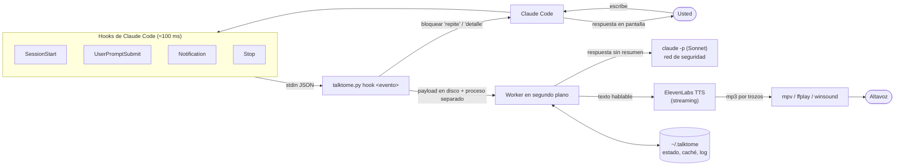

Los cuatro eventos que TalkToMe escucha:

| Evento | Handler | Efecto |
|---|---|---|
| `SessionStart` | `hooks.handle("session")` | Encola el saludo, con el nombre del proyecto. |
| `UserPromptSubmit` | `hooks.handle("prompt")` | Calla a Rachel en esa terminal; intercepta "repite" y "detalle". |
| `Notification` | `hooks.handle("notification")` | Permisos, pedidos de atención y recordatorios de espera. |
| `Stop` | `hooks.handle("stop")` | Encola la respuesta final para decirla. |

## 3. Módulos y dependencias

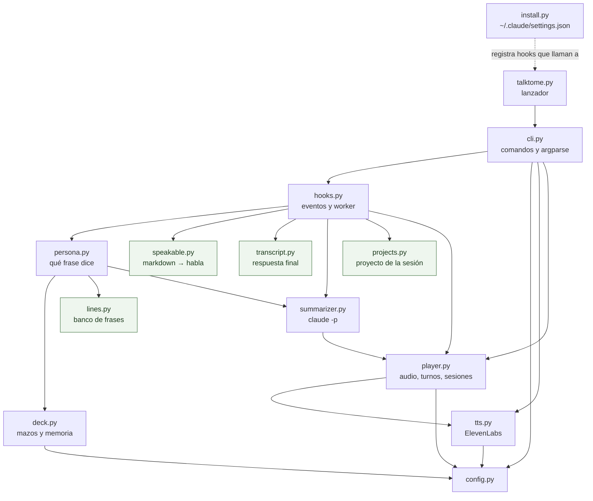

En verde, los módulos **puros**: sin red, audio ni estado global, y por eso los más probados.

| Módulo | Responsabilidad |
|---|---|
| `cli.py` | Punto de entrada. Comandos del usuario (`say`, `repite`, `design`, `doctor`…) y comandos internos (`hook`, `_speak`, `_repeat`, `_detail`). |
| `hooks.py` | Traduce cada evento de Claude Code en una decisión rápida (`handle`) y hace el trabajo lento en el worker (`work`, `detail`). Contiene `compose_reply`, la lógica de qué decir. |
| `speakable.py` | Convierte markdown en prosa para el oído; detecta el resumen hablado y si la respuesta pide algo. |
| `transcript.py` | Lee el transcript JSONL de la sesión y extrae la respuesta final, sin la narración intermedia. |
| `summarizer.py` | Llama a `claude -p` para resumir, narrar el detalle o inventar frases. |
| `persona.py` | Elige las frases fijas de Rachel: saludo, permisos, espera, distintivo de proyecto. |
| `lines.py` | El banco de frases del universo Blade Runner, con tono y momento del día. |
| `deck.py` | Mazos barajados, escalada de la espera, fechas especiales y frases inventadas, persistidos en `lines.json`. |
| `projects.py` | Deduce el proyecto de una sesión y su nombre hablado; aplica la configuración propia del proyecto. |
| `player.py` | Reproduce audio, lanza workers, gestiona el turno de voz entre sesiones, la interrupción y la memoria de cada sesión. |
| `tts.py` | Cliente de ElevenLabs: streaming, WAV, caché, Voice Design, voces y cuota. |
| `config.py` | Valores por defecto + `talktome.config.json` + `.env` + variables de entorno. |

## 4. Del hook al altavoz: una respuesta

El hook `Stop` tiene que volver enseguida, así que solo deja el payload en disco y lanza un proceso separado. Todo lo demás pasa en el worker.

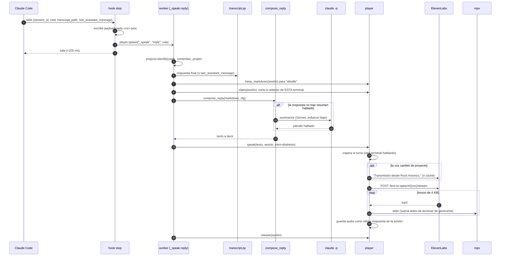

Detalles que importan:

- **Se reclama antes de resumir.** `claim` va antes de `compose_reply`: si usted escribe mientras el resumidor trabaja, el hook `prompt` mata al worker antes de que diga algo viejo.
- **El transcript puede ir atrasado.** Si Claude Code no manda `last_assistant_message`, `_reply_from` reintenta leer el transcript hasta 6 veces, cada 250 ms.
- **Solo la respuesta final.** `transcript.final_reply` recorre el JSONL de atrás hacia adelante y se detiene en la última llamada a herramienta: la narración intermedia ("voy a revisar el archivo…") no se dice.

## 5. Qué decir: las tres capas

Leer una respuesta técnica completa suena a robot y gasta créditos. `hooks.compose_reply` decide qué decir:

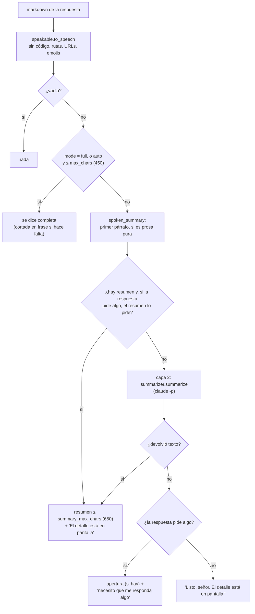

| Capa | Dónde | Costo | Latencia |
|---|---|---|---|
| 1. Estilo Rachel | `claude/output-styles/rachel.md` obliga a Claude a abrir con un resumen hablado. | Nada extra | Nada |
| 2. Red de seguridad | `summarizer.summarize`: `claude -p --model sonnet --effort low`, sin herramientas ni hooks, en una carpeta neutral. | Plan de Claude | 5–15 s |
| 3. Aviso mínimo | `persona.needs_answer` / `persona.done` | Nada (caché) | Nada |

Un primer párrafo que **no** incluye la pregunta con la que termina la respuesta no cuenta como resumen: es solo el comienzo de la respuesta, y dejaría al usuario sin saber que le preguntaron algo.

`speakable.to_speech` hace el trabajo fino: reemplaza bloques de código por "Le dejé el código en pantalla.", deja solo el nombre de archivo de una ruta, convierte enlaces en su texto, borra tablas, emojis y marcas, y añade puntos a títulos y viñetas para que la voz haga pausa. Las etiquetas de audio como `[whispers]` solo se conservan con `eleven_v3`.

## 6. Interrupción, "repite" y "detalle"

`UserPromptSubmit` es el único hook que puede **bloquear** el mensaje: si el mensaje completo es "repite" o "detalle" (sin tildes, puntuación, "Rachel" ni "por favor"), responde `{"decision": "block"}` y el mensaje nunca llega a Claude.

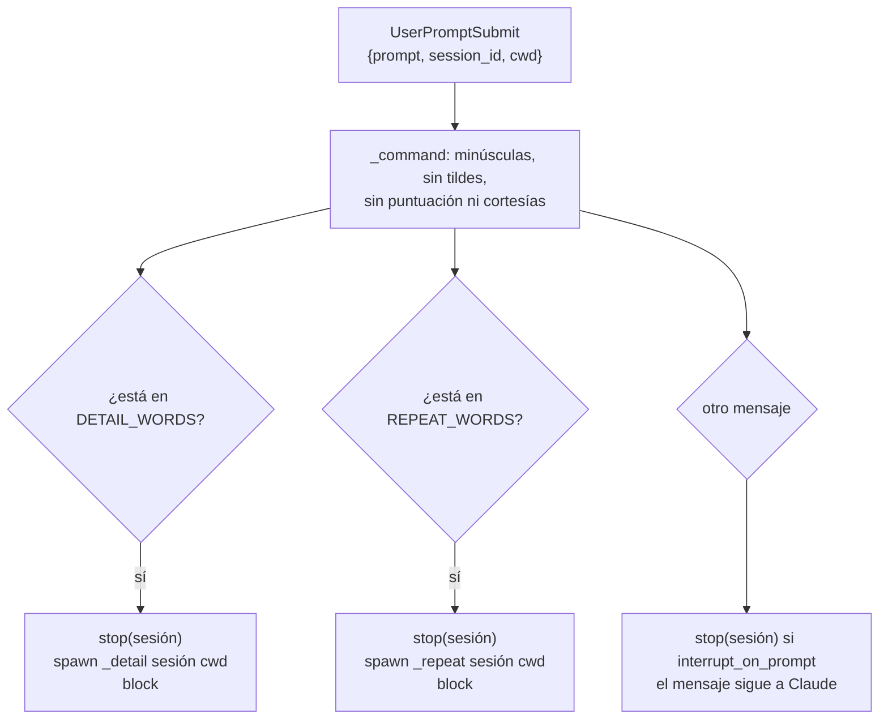

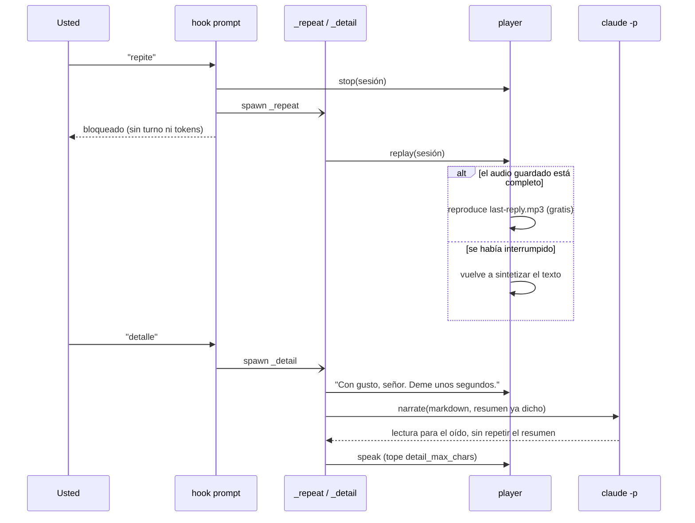

Si el narrador falla, "detalle" lee la respuesta limpia tal cual.

## 7. Varias terminales: sesiones y turnos

Cada terminal es una sesión de Claude Code con su propio `session_id`. TalkToMe separa dos cosas:

- **La memoria es por sesión**: última respuesta (texto, audio, markdown), proyecto y worker activo, en `~/.talktome/sessions/<id>/`.
- **El altavoz es uno solo**: `speaking.pid` indica quién tiene la palabra.

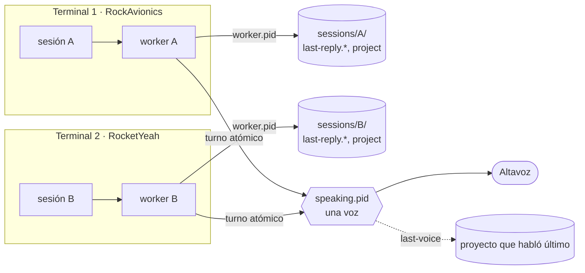

Reglas:

| Situación | Resultado |
|---|---|
| Escribe en la terminal A mientras habla B | B termina su frase; solo se corta lo de A (`stop(sesión)`). |
| A y B terminan a la vez | El segundo espera su turno: hasta 300 s una respuesta, 180 s un aviso. El recordatorio de espera no espera: se omite. |
| A responde dos veces seguidas | La respuesta nueva corta a la anterior de A (`claim(sesión)` mata al worker previo). |
| La voz pasa de A a B | Antes de hablar, B dice su distintivo: "Transmisión desde Rocket Yeah." |
| `talktome.py say` / `stop` en una consola | Sin sesión: toma la palabra de inmediato y corta a quien hable. |

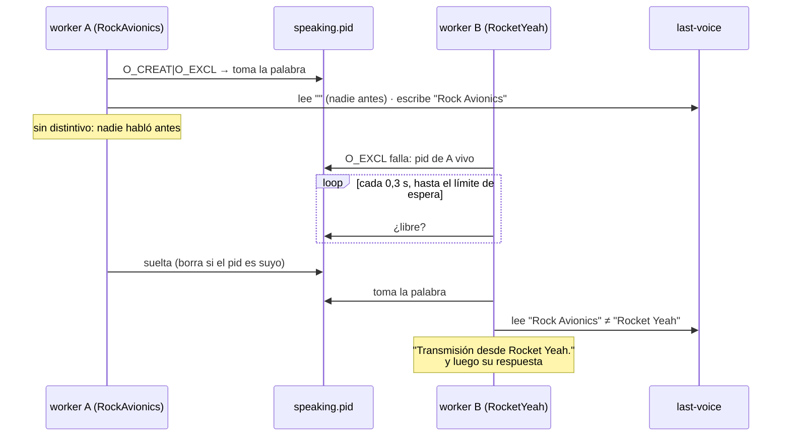

**Por qué el turno es atómico:** si dos workers esperan y el altavoz se libera, los dos podrían escribir `speaking.pid` y hablar a la vez. `os.open(O_CREAT | O_EXCL)` garantiza que solo uno lo crea. Si el dueño del archivo murió sin soltarlo, el siguiente lo detecta (`_alive`) y lo borra. Un archivo vacío de menos de 5 s se respeta: alguien lo está escribiendo.

**Nombre del proyecto:** `projects.identify(cwd)` sube desde `cwd` hasta la carpeta con `.git` y toma su nombre (`RockAvionics` → "Rock Avionics"). La clave `projects` de la config puede cambiar ese nombre o dar al proyecto su propia voz, trato o ajustes, que se aplican solo a los workers de esa sesión.

## 8. Frases de Rachel: mazos barajados

Saludos, permisos, recordatorios y distintivos salen de `lines.py`. Cada frase lleva **tono** (1 suave, 2 irónico, 3 dramático) y **momento** (`day`, `night` o cualquiera).

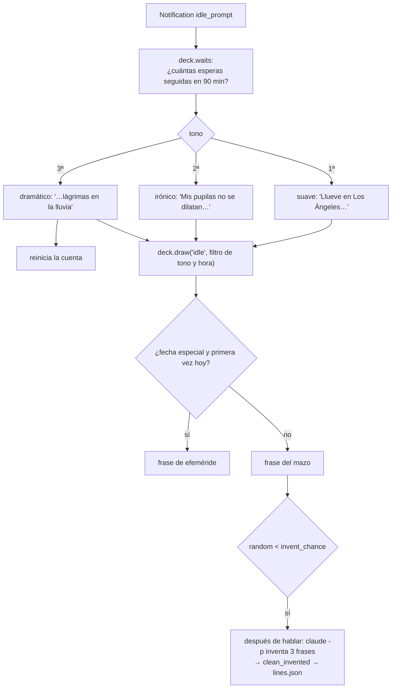

`deck.draw` implementa un mazo barajado persistente:

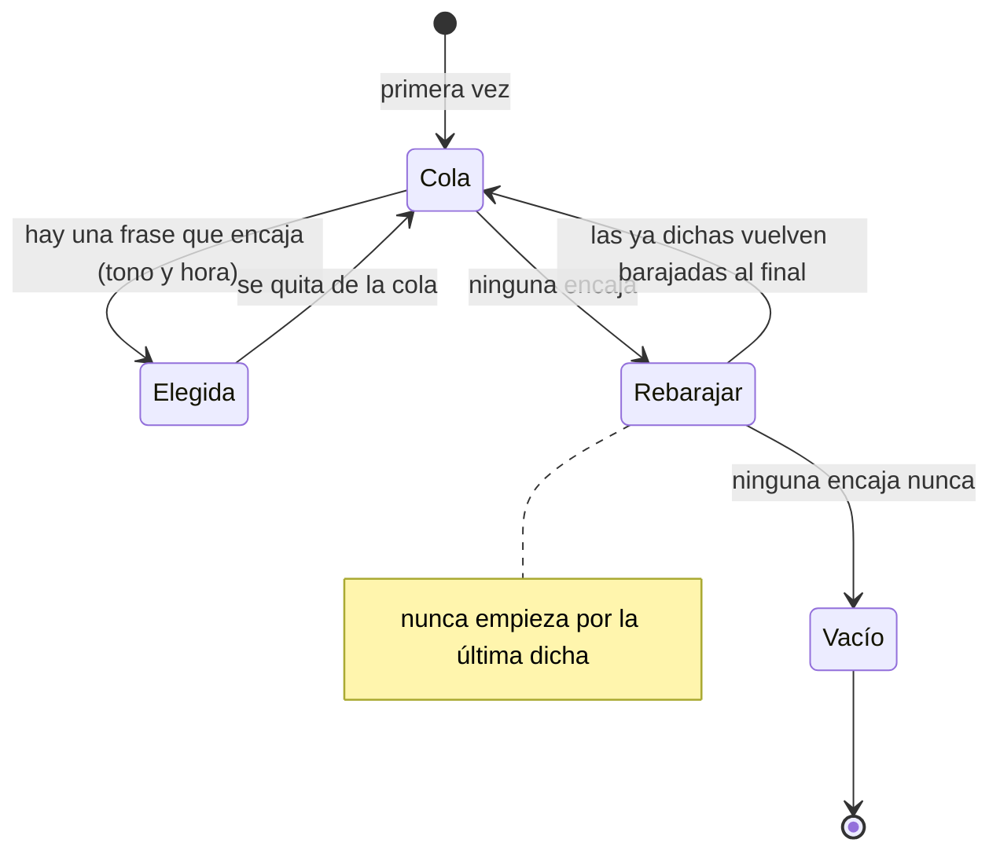

Las frases que no encajan ahora (una de noche a mediodía) conservan su lugar en la cola. Los mazos activos son `greeting`, `idle`, `permission`, `permission-tool`, `attention`, `callsign` y `opening`.

## 9. Audio: streaming, caché y reproductores

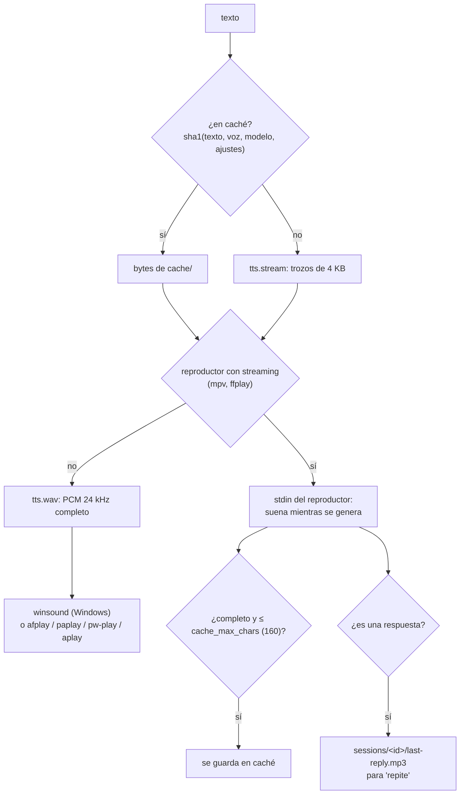

- **Interrumpir** es matar el grupo de procesos del worker (`os.killpg` en POSIX, `taskkill /T` en Windows): el reproductor muere con él, el `write` al pipe falla y el audio incompleto no se guarda.
- En Windows, los procesos hijos se lanzan con `CREATE_NO_WINDOW` para que no aparezcan consolas, y el worker con `CREATE_BREAKAWAY_FROM_JOB` para que sobreviva al hook.
- Solo `eleven_flash_v2_5` y `eleven_turbo_v2_5` reciben `language_code`; los otros modelos lo rechazan.

## 10. Estado en disco

Todo vive en `~/.talktome` (o en `TALKTOME_STATE`; las pruebas usan una carpeta temporal).

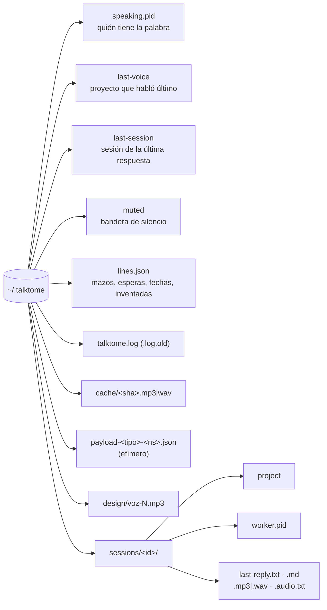

`last-reply.audio.txt` guarda el texto que corresponde al audio: si no coincide con `last-reply.txt` (la respuesta se interrumpió), "repite" vuelve a sintetizar en lugar de reproducir un audio a medias. Las sesiones sin cambios en 14 días se borran solas. El log rota a los 500 KB.

## 11. Instalación en Claude Code

`install.py` edita `~/.claude/settings.json` (con copia `settings.json.bak-talktome`) y es idempotente: primero quita cualquier hook suyo (los reconoce por `talktome.py` en el comando) y luego añade los cuatro.

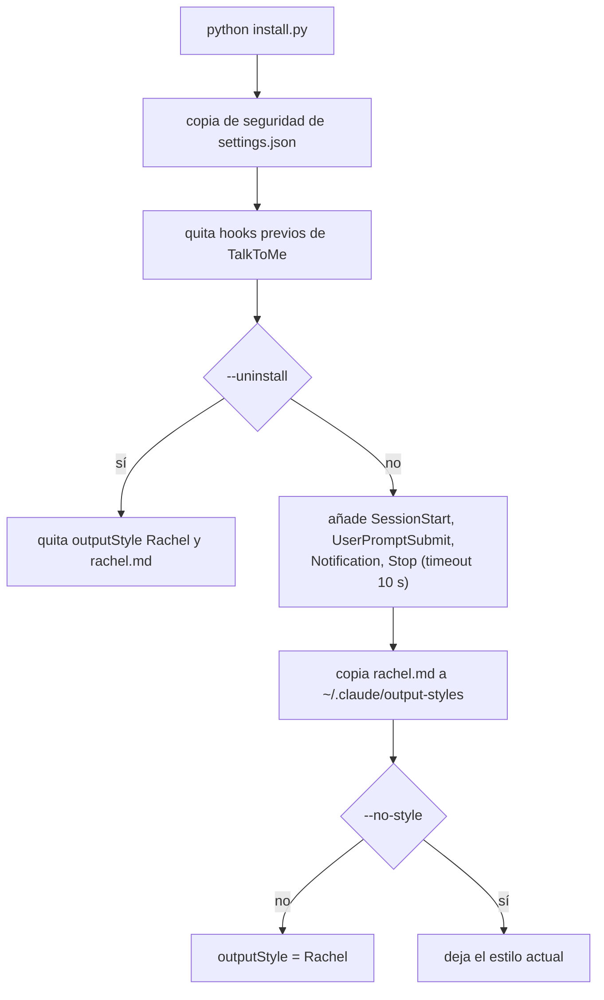

El comando del hook está pensado para funcionar igual en Git Bash y en PowerShell: el intérprete va sin comillas (o por su nombre en el `PATH` si su ruta tiene espacios). Solo si ninguna de las dos cosas es posible fija `"shell": "powershell"` con `& "…"`.

## 12. Errores y diagnóstico

| Mecanismo | Dónde |
|---|---|
| Excepciones de hooks y workers | `cli._log_error` → traza completa en `talktome.log`. El hook sale con 0. |
| Una línea por decisión | `hooks.log`: largo en pantalla y hablado, proyecto, si hubo resumidor y cuánto tardó, avisos omitidos. |
| Fallas del resumidor | `summarizer._log`: código de salida y los primeros 300 caracteres del error. |
| Autodiagnóstico | `talktome.py doctor`: config, clave enmascarada y su origen, reproductor, silencio, cuota. |
| Evitar bucles | `TALKTOME_DISABLE=1` en el entorno del `claude -p` interno: sus propios hooks no hacen nada. Además corre con `disableAllHooks`. |

## 13. Cómo extenderlo

| Quiero… | Dónde |
|---|---|
| Frases nuevas | `lines.py` (texto, tono, momento). Las pruebas exigen que quepan en la caché. |
| Otro evento de Claude Code | `EVENTS` en `install.py` + una rama en `hooks.handle`. |
| Otro motor de voz | `tts.stream` / `tts.wav` con la misma firma; `player` no sabe de ElevenLabs. |
| Otro reproductor | `STREAM_PLAYERS` o `FILE_PLAYERS` en `player.py`. |
| Otra palabra de comando como "repite" | Un conjunto como `REPEAT_WORDS` + rama en `handle` que devuelva `block`. |
| Una voz por proyecto | Sin código: `projects` en `talktome.config.json`. |
| Fase 2, dictado por voz | Un nuevo productor de prompts; el lado de la voz (sesiones, turnos, interrupción) ya está listo para varias fuentes. |

```bash
python -m unittest -v   # sin red ni audio
```

| Archivo de pruebas | Cubre |
|---|---|
| `tests/test_speech.py` | Limpieza de markdown, resumen hablado, `compose_reply`, "repite", "detalle", turnos, transcript. |
| `tests/test_lines.py` | Mazos, escalada, hora del día, fechas especiales, frases inventadas. |
| `tests/test_sessions.py` | Aislamiento por sesión, turno atómico, interrupción por terminal, distintivos, proyectos. |
